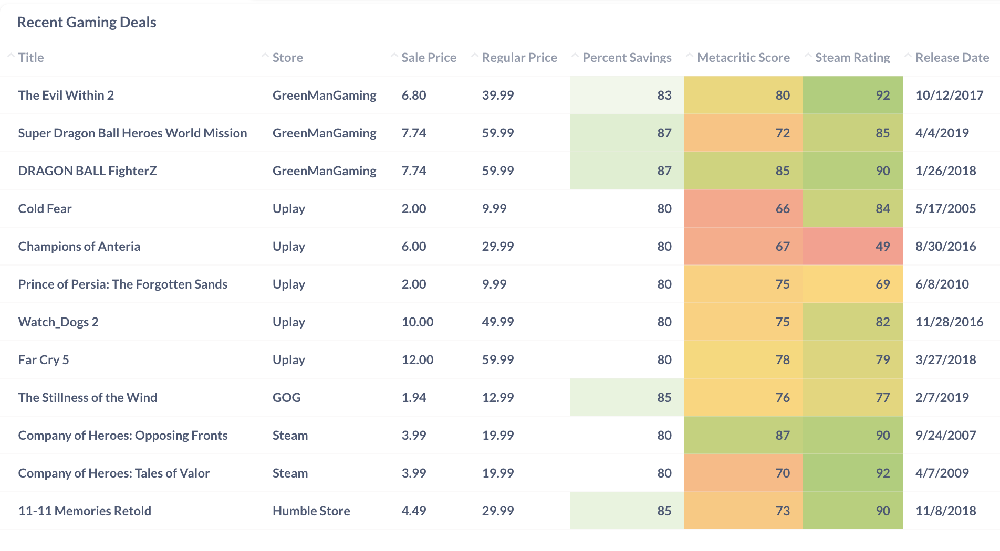
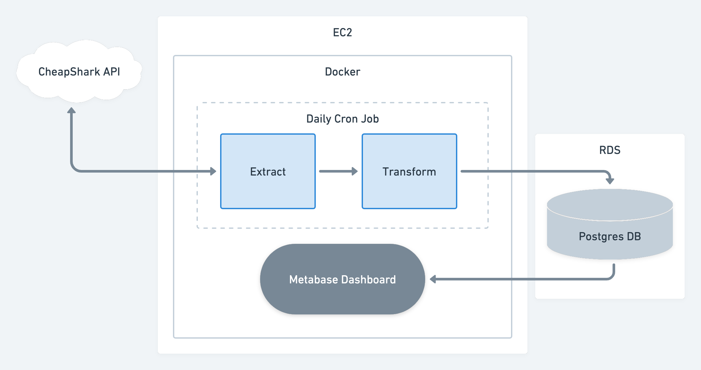

# Recent Gaming Deals Tracker

This is a data pipeline that pulls recent gaming bargains from [Cheap Shark](https://www.cheapshark.com/) via their API. The data ingested in turn supports [this interactive dashboard](http://18.214.233.99:3000/public/dashboard/fe0614d2-c8a3-4f8c-a1a9-a694c85055cf). (For cost-saving reasons and maintainence reasons, the dashboard is currently disabled :( )

*were it currently online, this is how the dashboard would appear. * 

## Architecture

All of the computing is performed within a small EC2 instance, while the warehouse used to store the data is a RDS PostgreSQL database. A single [Python script](src/api_etl.py) (automated, for now, via a simple cron job) queries two API endpoints (["stores"](https://apidocs.cheapshark.com/#f0bc20fe-688b-68d9-df27-22d6f6441849) for information about digital game vendors and ["deals"](https://apidocs.cheapshark.com/#c33f57dd-3bb3-3b1f-c454-08cab413a115) for the details of all the different games on sale), performs some light transformation on the data it receives, then writes that data to the DB. A [view](sql_scripts/dashboard_view.sql) instantiated within the relevant schema combines the two tables into a single clean dataset that the dashboard draws from to populate itself. Both the ETL script and the dashboard are run via Docker containers running on the EC2 instance; for convenience, the dashboard stores its metadata (RDS login details, dashboard details, etc.) on the EC2 instance via a Docker volume.

## Design Considerations

*Why use RDS instead of Redshift?*
  
Given the small amount of data being handled by this app (< 10,000 rows) and that none of that data is retained for more than a day, any sort of OLTP vs. OLAP cost-benefit analysis is moot here; both options easily meet performance requirements. A simple database on RDS wins out for two reason:
1) Spinning up an entire data warehouse for something this modest is simply overkill. Why go through the hassle of provisioning and maintaining it?
2) This project is designed not to exceed the allowances of AWS's Free Tier, and the Free Tier is much more generous with what it allows for RDS than what it allows for Redshift.
  
On a tangential note, it isn't even strictly necessary to use RDS for hosting the database to have the entire app running on the cloud. I could instead have spun up the Postgres database on the EC2 instance in another Docker container. While I considered doing this, I chose to use RDS if only to demonstrate a broader familiarity with different AWS tools and features.
  
*Why automate with a cron job as opposed to a tool like Airflow?*
  
First of all, implementing Airflow for this project may be something I come back to do in the future. While some may see cron jobs as a little... old-fashioned, the actual ETL work being done here is simple enough that using one does suffice. There are no complex dependencies, no need for backfilling, and no automation requirements more convoluted than "Run this single script once a day." That being said, were this project to become a little more complex – say, if I wanted to start storing data for longer to track how long different sales are running for – then I'd almost certainly roll out Airflow implementation as well to handle the more complicated data integration and clean-up needs.

## Future Refinements

As I get the time, I plan to return to this project and make some of the following additions:
* Automate data ingestion, transformation, and clean-up with Airflow.
* ~~Switch the dashboard's metadata storage from bind mount to Docker volume.~~
* Incorporate further endpoints (from this source or others) to expand functionality.
* Possibly re-work the AWS services used here (implement ECS for Docker, switch to Elastic Beanstalk for the dashboard, etc.).

